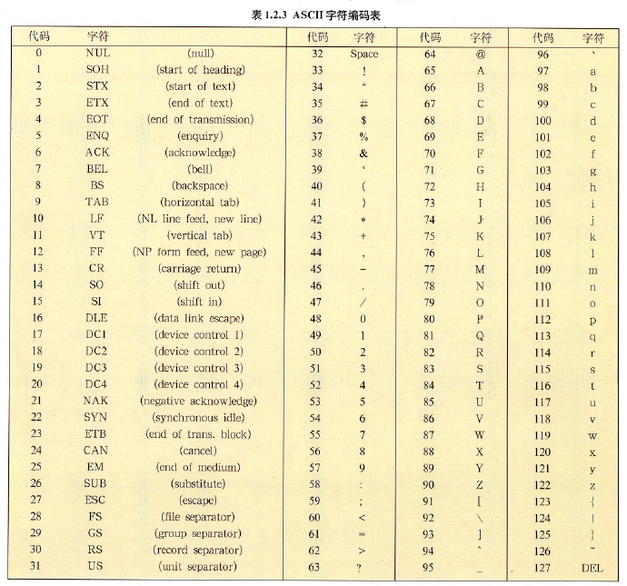

# 『密码学应用』之字符编码

<!-- vim-markdown-toc GFM -->

* [字符集](#字符集)
    * [ASCII 字符集](#ascii-字符集)
    * [GB2312-80 字符集](#gb2312-80-字符集)
    * [GBK 字符集](#gbk-字符集)
    * [GB18030-2000 字符集](#gb18030-2000-字符集)
    * [GB18030-2005 字符集](#gb18030-2005-字符集)
    * [Unicode 字符集](#unicode-字符集)
* [编码](#编码)
    * [UTF-8 编码](#utf-8-编码)
* [Go 语言中的 byte 和 rune](#go-语言中的-byte-和-rune)

<!-- vim-markdown-toc -->

## 字符集

### ASCII 字符集

ASCII 是基于拉丁字母的一套电脑编码系统，主要用于显示现代英语和其他西欧语言，它是最通用的信息交换标准。

只包括 127 个常见字符，也就是大小写英文字母、数字和一些非打印控制字符。

优点：一个字符占一个字节。

缺点：能表示的字符数量少，无法表示各国的文字（因此中国指定了 GB2312 字符集）。



### GB2312-80 字符集

> 《信息交换用汉字编码字符集基本集》

GB2312-80 是 1980 年制定的中国汉字编码国家标准。共收录 7445 个字符，其中汉字 6763 个。

GB2312 兼容标准 ASCII 码，采用扩展 ASCII 码的编码空间进行编码，一个汉字占用两个字节。

GB2312 包含的汉字依旧有限，因此国家标准化委员会又制定了 GB13000，然而与 GB2312 完全不兼容，导致无法推广。

### GBK 字符集

> 《汉字内码扩展规范》

GBK 于 1995 年制定，兼容 GB2312、GB13000-1 编码中的所有汉字，使用双字节编码，收录了 21003 个汉字。

### GB18030-2000 字符集

> 《信息交换用汉字编码字符集基本集的补充》

GB18030-2000 编码标准是由信息产业部和国家质量技术监督局在 2000 年 3 月 17 日联合发布的，并且将作为一项国家标准在
2001 年的 1 月正式强制执行，是我国计算机系统必须遵循的基础性标准之一。

### GB18030-2005 字符集

> 《信息技术中文编码字符集》

GB18030-2005 是中华人民共和国现时最新的内码字集，是 GB18030-2000 的修订版。

18030-2005 是以汉字为主并包含多种我国少数民族文字（如藏、蒙古、傣、彝、朝鲜、维吾尔文等）
的超大型中文编码字符集强制性标准，与 GB2312-1980 和 GBK 兼容，共收录汉字 70244 个。

### Unicode 字符集

Unicode 是国际组织制定的可以容纳世界上所有文字和符号的字符编码方案，
是计算机科学领域里的一项业界标准，包括字符集、编码方案等。

优点：跨语言、跨平台，可以表示所有字符。

缺点：一个字符占两个字节，包括普通的 ASCII 字符，造成浪费。

## 编码

注意：ASCII、GB2312 和 Unicode 等属于字符集，而 UTF-8, UTF-16, Utf-32 等编码是存储和传输上面的概念。

### UTF-8 编码

UTF-8 是一种传输格式，以一个字节（8 位）为单位传输字符。

如果是 ASCII 字符（占一个字节），仅需一个字节即可容纳；

如果是非 ASCII 字符的 Unicode 字符（占两个字节），则需要截断以字节为单位进行传输。

优点：可以表示所有语言和文字，在存储和传输上更节约空间、提高性能。

*   编码时

    如果是 ASCII 字符（占一个字节），仅需一个字节即可容纳。

    如果是非 ASCII 字符的 Unicode 字符（占两个字节），则需要截断，因此需要增加额外的标志位来描述截断信息，所以需要三个字节方可容纳。

*   解码时

    根据每个字节标志位的信息确定一个字符所占的字节数，将被截断的多个字节重新还原为一个字符。

*   标志位

    根据需要使用的字节数，编码时的标志位如下：

    *   需要一个字节：`0.......`
    *   需要两个字节：`110.....` `10......`
    *   需要三个字节：`1110....` `10......` `10......`
    *   需要四个字节：`11110...` `10......` `10......` `10......`
    *   ...（依此类推）

*   示例一

    字母“A”的 Unicode 编码十进制表示为：**65**，十六进制表示为：41，
    二进制表示为：1000001，占用一个字节。
    如果使用 UTF-8 编码不需要截断，编码后为：<span style="color:red">0</span>1000001。

*   示例二

    汉字“啊”的 Unicode 编码十进制表示为：**21834**，十六进制表示为：554A，
    二进制表示为：01010101 01001010，占用两个字节。

    如果使用 UTF-8 编码则需要截断，并且需要额外的一个字节作为标志位来描述截断信息，所以一共需要三个字节。

    编码后为：<span style="color:red">1110</span>0101 <span style="color:red">10</span>010101 <span style="color:red">10</span>001010，分别转换为十进制为：**229 149 138**。

## Go 语言中的 byte 和 rune

在 go 语言中，内置类型 byte 和 rune 语义上分别表示字节和字符。

```go
// byte is an alias for uint8 and is equivalent to uint8 in all ways. It is
// used, by convention, to distinguish byte values from 8-bit unsigned
// integer values.
type byte = uint8

// rune is an alias for int32 and is equivalent to int32 in all ways. It is
// used, by convention, to distinguish character values from integer values.
type rune = int32
```

分别使用 `[]byte` 和 `[]rune` 来保存字符串 "A啊" 即可看出两者的区别：

```go
a := []byte("A啊")
b := []rune("A啊")

fmt.Println(len(a), a)                        // output: 4 [65 229 149 138]
fmt.Println(len(b), b)                        // output: 2 [65 21834]

fmt.Println(string([]byte{a[1]}))             // output:
fmt.Println(string([]byte{a[1], a[2], a[3]})) // output: 啊
fmt.Println(string([]rune{b[1]}))             // output: 啊
```

因为 `byte` 为 `uint8` 的别名，占 8 位内存。`rune` 为 `int32` 的别名，占 32 位内存。上述代码中

`len(a)` 为 4，因此变量 a 一共占用 8 * 4 = 32 位内存。

`len(b)` 为 2，因此变量 b 一共占用 32 * 2 = 64 位内存。

因此可以得出结论：使用 `[]byte` 更节省内存。

但是使用 `[]byte` 无法简单地通过下标直接访问到汉字等非 ASCII 字符，而使用 `[]rune` 则可以。

可以使用 Unicode 编码十进制值或单引号表示的字符字面量对 `[]byte` 或 `[]rune` 的单个元素赋值。例如：

```go
c := []byte("AAAA")
d := []rune("啊")

fmt.Println(string(c), c) // output: AAAA [65 65 65 65]
fmt.Println(string(d), d) // output: 啊 [21834]

c[0] = 97
c[1] = 'a'
c[2] = c[2] + 32
c[3] = 'A' + 32
d[0] = '哈'

fmt.Println(string(c), c) // output: aaaa [97 97 97 97]
fmt.Println(string(d), d) // output: 哈 [21704]
```

使用单引号表示字符时支持偏移指定整数，例如字符 'a' 的 Unicode 编码值为 97，'A' 的 Unicode 编码值为 65，相差 32。
因此使用 `'A' + 32` 的结果即为 `'a'`

