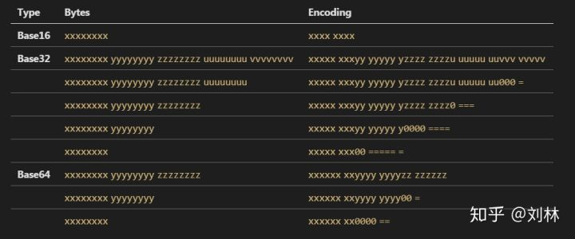

# 『密码学应用』之二进制数据编码

<!-- vim-markdown-toc GFM -->

* [计量单位](#计量单位)
* [编码目的](#编码目的)
* [Base16（hex）](#base16hex)
* [Base32](#base32)
* [Base64](#base64)
* [Base128?](#base128)
* [编码对比](#编码对比)
* [参考资料](#参考资料)

<!-- vim-markdown-toc -->

## 计量单位

| 计量单位 | 倍率换算 | 描述       |
|----------|----------|------------|
| 1 bit    | 0,1      | bit        |
| 1 B      | 8    bit | byte       |
| 1KB      | 1024 B   | Kilobyte   |
| 1MB      | 1024 KB  | Megabyte   |
| 1GB      | 1024 MB  | Gigabyte   |
| 1TB      | 1024 GB  | Terabyte   |
| 1PB      | 1024 TB  | Petabyte   |
| 1EB      | 1024 PB  | Exabyte    |
| 1ZB      | 1024 EB  | Zettabyte  |
| 1YB      | 1024 ZB  | Yottabyte  |
| 1BB      | 1024 YB  | Brontobyte |
| 1NB      | 1024 BB  | NonaByte   |
| 1DB      | 1024 NB  | DoggaByte  |

## 编码目的

编码的目的是将二进制数组变成可见字符，例如可用于在 HTTP 环境下传递较长的标识信息。
编码并非加密，解码后可以恢复原文。

> Base 系列的原理：
> 我们知道计算机中，存储的的二进制码，是一个字节（8 位）一组。
> Base 系列编码，本质上就是将字节切片组合，然后为重组后的数字找一个对应的、可见的 ASCII 字符，这就是 Base 系列编码了。



## Base16（hex）

Base16 实际上是将二进制数据转为十六进制，意思是使用 16 个可见字符来表示二进制数据。

由于 16 等于 2 的 4 次方，因此数据按 4 位切为一组，1 个字节需要用 2 个可见字符来展示。

```
00000000 11111111 -> 0000 0000 1111 1111
```

Base16 字符序列：

| 0 | 1 | 2 | 3 | 4 | 5 | 6 | 7 | 8 | 9 | 10 | 11 | 12 | 13 | 14 | 15 |
|---|---|---|---|---|---|---|---|---|---|----|----|----|----|----|----|
| 0 | 1 | 2 | 3 | 4 | 5 | 6 | 7 | 8 | 9 | A  | B  | C  | D  | E  | F  |

## Base32

Base32 实际上是将二进制数据转为三十二进制，意思是使用 32 个可见字符来表示二进制数据。

由于 32 等于 2 的 5 次方，因此数据按 5 位切为一组，5 个字节需要用 8 个可见字符来表示。

1. 如果不够 5 位，则在最后一组后边补 0。
2. 最后总组数必须为 8 的倍数，否则补一个 = 作为一组。

```
00000000 11111111 00000000 11111111 00000000 11111111  00000 00011 11111 10000 00001 11111 11000 00000  AD7QB7YA74======
                                                       11111 11100     =     =     =     =     =     =
00000000 11111111 00000000 11111111 00000000           00000 00011 11111 10000 00001 11111 11000 00000  AD7QB7YA
00000000 11111111 00000000 11111111                    00000 00011 11111 10000 00001 11111 11000     =  AD7QB7Y=
00000000 11111111 00000000                             00000 00011 11111 10000 00000     =     =     =  AD7QA===
00000000 11111111                                      00000 00011 11111 10000     =     =     =     =  AD7Q====
00000000                                               00000 00000     =     =     =     =     =     =  AA======
```

Base32 编码字符序列（两种方案）：

字母方案（Aplphabet）

| 0 | 1 | 2 | 3 | 4 | 5 | 6 | 7 | 8 | 9 | 10 | 11 | 12 | 13 | 14 | 15 |
|---|---|---|---|---|---|---|---|---|---|----|----|----|----|----|----|
| A | B | C | D | E | F | G | H | I | J | K  | L  | M  | N  | O  | P  |


| 16 | 17 | 18 | 19 | 20 | 21 | 22 | 23 | 24 | 25 | 26 | 27 | 28 | 29 | 30 | 31 | pad |
|----|----|----|----|----|----|----|----|----|----|----|----|----|----|----|----|-----|
| Q  | R  | S  | T  | U  | V  | W  | X  | Y  | Z  | 2  | 3  | 4  | 5  | 6  | 7  | =   |

扩展十六进制方案（Extended Hex）

| 0 | 1 | 2 | 3 | 4 | 5 | 6 | 7 | 8 | 9 | 10 | 11 | 12 | 13 | 14 | 15 |
|---|---|---|---|---|---|---|---|---|---|----|----|----|----|----|----|
| 0 | 1 | 2 | 3 | 4 | 5 | 6 | 7 | 8 | 9 | A  | B  | C  | D  | E  | F  |


| 16 | 17 | 18 | 19 | 20 | 21 | 22 | 23 | 24 | 25 | 26 | 27 | 28 | 29 | 30 | 31 | pad |
|----|----|----|----|----|----|----|----|----|----|----|----|----|----|----|----|-----|
| G  | H  | I  | J  | K  | L  | M  | N  | O  | P  | Q  | R  | S  | T  | U  | V  | =   |

## Base64

Base64 实际上是将二进制数据转为六十四进制，意思是使用 64 个可见字符来表示二进制数据。

由于 64 等于 2 的 6 次方，因此数据按 6 位切为一组，5 个字节需要用 8 个可见字符来表示。

1. 如果不够 6 位，则在最后一组后边补 0。
2. 最后总组数必须为 4 的倍数，否则补一个 = 作为一组。

```
00000000 11111111 00000000 11111111 00000000 11111111  000000 001111 111100 000000  AP8A/wD/
                                                       111111 110000 000011 111111
00000000 11111111 00000000 11111111 00000000           000000 001111 111100 000000  AP8A/wA=
                                                       111111 110000 000000      =
00000000 11111111 00000000 11111111                    000000 001111 111100 000000  AP8A/w==
                                                       111111 110000      =      =
00000000 11111111 00000000                             000000 001111 111100 000000  AP8A
00000000 11111111                                      000000 001111 111100      =  AP8=
00000000                                               000000 000000      =      =  AA==
```

Base64 编码字符序列（两种方案）：

字母方案（Aplphabet）

| 0 | 1 | 2 | 3 | 4 | 5 | 6 | 7 | 8 | 9 | 10 | 11 | 12 | 13 | 14 | 15 |
|---|---|---|---|---|---|---|---|---|---|----|----|----|----|----|----|
| A | B | C | D | E | F | G | H | I | J | K  | L  | M  | N  | O  | P  |


| 16 | 17 | 18 | 19 | 20 | 21 | 22 | 23 | 24 | 25 | 26 | 27 | 28 | 29 | 30 | 31 |
|----|----|----|----|----|----|----|----|----|----|----|----|----|----|----|----|
| Q  | R  | S  | T  | U  | V  | W  | X  | Y  | Z  | a  | b  | c  | d  | e  | f  |


| 32 | 33 | 34 | 35 | 36 | 37 | 38 | 39 | 40 | 41 | 42 | 43 | 44 | 45 | 46 | 47 |
|----|----|----|----|----|----|----|----|----|----|----|----|----|----|----|----|
| g  | h  | i  | j  | k  | l  | m  | n  | o  | p  | q  | r  | s  | t  | u  | v  |


| 48 | 49 | 50 | 51 | 52 | 53 | 54 | 55 | 56 | 57 | 58 | 59 | 60 | 61 | 62 | 63 | pad |
|----|----|----|----|----|----|----|----|----|----|----|----|----|----|----|----|-----|
| w  | x  | y  | z  | 0  | 1  | 2  | 3  | 4  | 5  | 6  | 7  | 8  | 9  | +  | /  | =   |

URL 和文件名安全方案（URL and Filename safe）

| 0 | 1 | 2 | 3 | 4 | 5 | 6 | 7 | 8 | 9 | 10 | 11 | 12 | 13 | 14 | 15 |
|---|---|---|---|---|---|---|---|---|---|----|----|----|----|----|----|
| A | B | C | D | E | F | G | H | I | J | K  | L  | M  | N  | O  | P  |


| 16 | 17 | 18 | 19 | 20 | 21 | 22 | 23 | 24 | 25 | 26 | 27 | 28 | 29 | 30 | 31 |
|----|----|----|----|----|----|----|----|----|----|----|----|----|----|----|----|
| Q  | R  | S  | T  | U  | V  | W  | X  | Y  | Z  | a  | b  | c  | d  | e  | f  |


| 32 | 33 | 34 | 35 | 36 | 37 | 38 | 39 | 40 | 41 | 42 | 43 | 44 | 45 | 46 | 47 |
|----|----|----|----|----|----|----|----|----|----|----|----|----|----|----|----|
| g  | h  | i  | j  | k  | l  | m  | n  | o  | p  | q  | r  | s  | t  | u  | v  |


| 48 | 49 | 50 | 51 | 52 | 53 | 54 | 55 | 56 | 57 | 58 | 59 | 60 | 61 | 62 | 63 | pad |
|----|----|----|----|----|----|----|----|----|----|----|----|----|----|----|----|-----|
| w  | x  | y  | z  | 0  | 1  | 2  | 3  | 4  | 5  | 6  | 7  | 8  | 9  | -  | _  | =   |

## Base128?

参考资料：[Base 128 Varint, 一种处理整数的变长二进制编码算法](http://skoo.me/algorithm/2013/09/30/base-128-varint)

## 编码对比

空间效率：

*   Base16 编码后数据大小变成原来的 2 倍。
*   Base32 编码后数据大小变成原来的 8/5。
*   Base64 编码后数据大小变成原来的 4/3。

字母大小写：

*   Base16 编码不区分大小写。
*   Base32 与 Base64 严格区分大小写。

## 参考资料

*   [Base64, Base32 和 Base16，用通俗的语言深入到内部](https://zhuanlan.zhihu.com/p/51316306)
