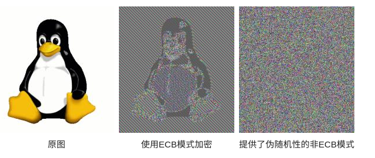
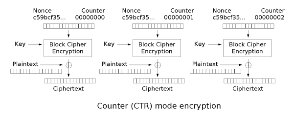
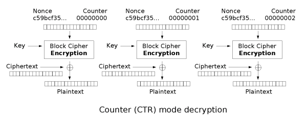

# 『密码学应用』之对称加密

<!-- vim-markdown-toc GFM -->

* [基础概述](#基础概述)
* [工作模式（mode of operation）](#工作模式mode-of-operation)
    * [电子密码本模式（Electronic Codebook，ECB）](#电子密码本模式electronic-codebookecb)
    * [密码块链接模式（Cipher Block Chaining，CBC）](#密码块链接模式cipher-block-chainingcbc)
    * [填充密码块链接模式（Propagating Cipher Block Chaining，PCBC）](#填充密码块链接模式propagating-cipher-block-chainingpcbc)
    * [密文反馈模式（Cipher Feedback，CFB）](#密文反馈模式cipher-feedbackcfb)
    * [输出反馈模式（Output Feedback，OFB）](#输出反馈模式output-feedbackofb)
    * [计数器模式（Counter，CTR）](#计数器模式counterctr)
* [初始化向量（Initialization Vector，IV）](#初始化向量initialization-vectoriv)
* [分块和填充](#分块和填充)
    * [ZeroPadding](#zeropadding)
    * [PKCS7Padding](#pkcs7padding)
    * [PKCS5Padding](#pkcs5padding)
* [示例：AES/CBC/PKCS7Padding 加解密 Go 语言实现](#示例aescbcpkcs7padding-加解密-go-语言实现)
* [参考资料](#参考资料)

<!-- vim-markdown-toc -->

## 基础概述


加密解密使用相同的密钥或是使用两个可以简单地相互推算的密钥
*   流密码（stream cipher）/ 序列密码（stream cipher）： 一次仅对明文中的单个位（有时是对字节）运算的算法
*   块密码（block cipher）/ 分组密码（block cipher）： 对明文的一组位进行运算，这些位组称为分组（block）

常见算法：
*   数据加密标准（Data Encryption Standard，DES）
*   高级加密标准（Advanced Encryption Standard，AES）
*   国密算法 SM1：加密强度与 AES 相当，该算法不公开，需要通过加密芯片的接口进行调用
*   国密算法 SM4：无线局域网标准的分组数据算法

本文主要介绍分组密码以及 AES 的使用。

## 工作模式（mode of operation）

块密码的工作模式描述了加密每一数据块的过程。

常见的模式有 ECB、CBC、PCBC、CFB、OFB、CTR 和 XTS 等。

### 电子密码本模式（Electronic Codebook，ECB）

需要加密的消息按照块密码的块大小被分为数个块，并对每个块进行独立加密。


本方法的缺点在于同样的明文块会被加密成相同的密文块；因此，它不能很好的隐藏数据模式。

在某些场合，这种方法不能提供严格的数据保密性，因此并不推荐用于密码协议中。

下面的例子显示了 ECB 在密文中显示明文的模式的程度：

该图像的一个位图版本（左图）通过 ECB 模式可能会被加密成中图，而非 ECB 模式通常会将其加密成右图。



### 密码块链接模式（Cipher Block Chaining，CBC）

每个明文块先与前一个密文块进行异或后，再进行加密。

在这种方法中，每个密文块都依赖于它前面的所有明文块。

同时，为了保证每条消息的唯一性，在第一个块中需要使用初始化向量。


CBC 是最为常用的工作模式，缺点是消息必须被填充到块大小的整数倍。

在加密时，过程是串行的，无法被并行化，明文中的微小改变会导致其后的全部密文块发生改变。

在解密时，从两个邻接的密文块中即可得到一个明文块，因此解密过程可以被并行化。
而密文中一位的改变只会导致其对应的明文块完全改变和下一个明文块中对应位发生改变，不会影响到其它明文的内容。

### 填充密码块链接模式（Propagating Cipher Block Chaining，PCBC）

可以使密文中的微小更改在解密时导致明文大部分错误的模式，并在加密的时候也具有同样的特性。


### 密文反馈模式（Cipher Feedback，CFB）

CFB 可以将块密码变成同步的流密码，工作过程与 CBC 非常相似。


### 输出反馈模式（Output Feedback，OFB）

OFB 可以将块密码变成同步的流密码。它产生密钥流的块，然后将其与明文块进行异或，得到密文。


### 计数器模式（Counter，CTR）

> 又称 ICM 模式（Integer Counter Mode）或 SIC 模式（Segmented Integer Counter）

与 OFB 相似，CTR 将块密码变为流密码。它通过递增一个加密计数器以产生连续的密钥流。

其中，计数器可以是任意保证长时间不产生重复输出的函数，但使用一个普通的计数器是最简单和最常见的做法。




## 初始化向量（Initialization Vector，IV）

各种工作模式加密的过程，通常使用一个称为初始化向量的附加输入值以进行随机化来保证安全。

初始化向量与密钥相比有不同的安全性需求，因此 IV 通常无须保密。

然而在大多数情况中，不应当在使用同一密钥的情况下两次使用同一个 IV。

对于 CBC 和 CFB，重用 IV 会导致泄露明文首个块的某些信息，亦包括两个不同消息中相同的前缀。

对于 OFB 和 CTR 而言，重用 IV 会导致完全失去安全性。

## 分块和填充

**分块**：块密码自身只能加密长度等于密码块长度的单块数据，若要加密变长数据，则数据必须先被划分为一些单独的密码块。

**填充**：通常而言，最后一块数据也需要使用合适填充方式将数据扩展到符合密码块大小的长度。

*   ECB 和 CBC 需要最后一块在加密前进行填充

*   CFB、OFB 和 CTR 模式不需要对长度不为密码块大小整数倍的消息进行特别的处理。

    因为这些模式是通过对块密码的输出与明文进行异或工作的。

    最后一个明文块（可能是不完整的）与密钥流块的前几个字节异或后，产生了与该明文块大小相同的密文块。

    流密码的这个特性使得它们可以应用在需要密文和明文数据长度严格相等的场合，也可以应用在以流形式传输数据而不便于进行填充的场合。

三种常用的填充模式：ZeroPadding、PKCS7Padding、PKCS5Padding


### ZeroPadding

数据长度不对齐时使用 0 填充，否则不填充。

### PKCS7Padding

假设数据长度需要填充 n(n>0) 个字节才对齐，那么填充 n 个字节，每个字节都是 n。

如果数据本身就已经对齐了，则填充一块长度为块大小的数据，每个字节都是块大小。

例如：假设块大小为 8 个字节

```
FF FF FF FF FF FF FF FF FF 07 07 07 07 07 07 07
FF FF FF FF FF FF FF FF 08 08 08 08 08 08 08 08
FF FF FF FF FF FF FF 01
FF FF FF FF FF FF 02 02
FF FF FF FF FF 03 03 03
```

由于使用 PKCS7Padding/PKCS5Padding 填充时，最后一个字节肯定为填充数据的长度，所以在解密后可以准确删除填充的数据。

而使用 ZeroPadding 填充时，没办法区分真实数据与填充数据，所以只适合以 \0 结尾的字符串加解密。

### PKCS5Padding

PKCS5Padding 是 PKCS7Padding 的子集，块大小固定为 8 字节。

而 PKCS7Padding 的块大小可以为 1 到 255 字节。

## 示例：AES/CBC/PKCS7Padding 加解密 Go 语言实现

```go
package aescbcpkcs7

import (
	"bytes"
	"crypto/aes"
	"crypto/cipher"
)

func PKCS7Padding(plantText []byte, blockSize int) []byte {
	padding := blockSize - len(plantText)%blockSize
	padtext := bytes.Repeat([]byte{byte(padding)}, padding)
	return append(plantText, padtext...)
}

func PKCS7UnPadding(plantText []byte) []byte {
	length := len(plantText)
	unpadding := int(plantText[length-1])
	return plantText[:(length - unpadding)]
}

func AesCBCEncrypt(plantText, key []byte) ([]byte, error) {
	block, err := aes.NewCipher(key)
	if err != nil {
		return nil, err
	}

	plantText = PKCS7Padding(plantText, block.BlockSize())

	ciphertext := make([]byte, len(plantText))
	cipher.NewCBCEncrypter(block, key[:block.BlockSize()]).
		CryptBlocks(ciphertext, plantText)

	return ciphertext, nil
}

func AesCBCDecrypt(ciphertext, key []byte) ([]byte, error) {
	block, err := aes.NewCipher(key)
	if err != nil {
		return nil, err
	}

	plantText := make([]byte, len(ciphertext))
	cipher.NewCBCDecrypter(block, key[:block.BlockSize()]).
		CryptBlocks(plantText, ciphertext)

	plantText = PKCS7UnPadding(plantText)

	return plantText, nil
}
```

## 参考资料

*   [分组密码工作模式](https://zh.wikipedia.org/wiki/%E5%88%86%E7%BB%84%E5%AF%86%E7%A0%81%E5%B7%A5%E4%BD%9C%E6%A8%A1%E5%BC%8F)
*   [三种填充模式的区别 (PKCS7Padding/PKCS5Padding/ZeroPadding)](https://blog.csdn.net/xiongya8888/article/details/84947232)
*   [PKCS5Padding 和 PKCS7Padding](https://blog.csdn.net/Stewart/article/details/52462273)
