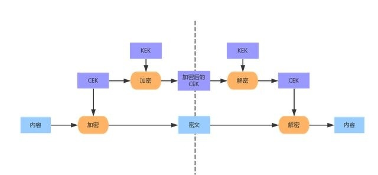
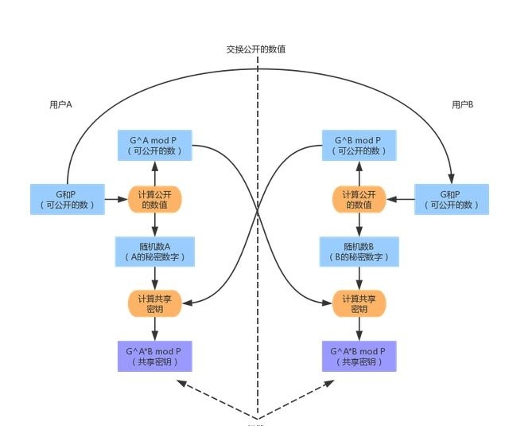
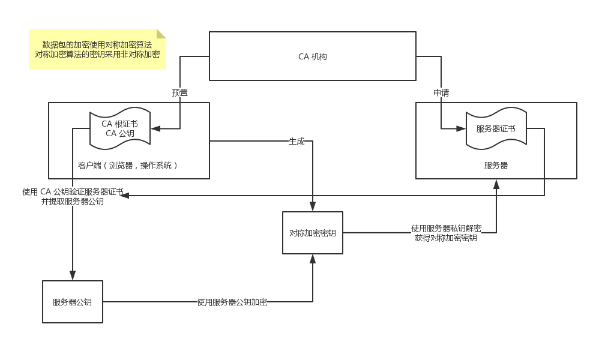

# 『密码学应用』之密钥交换

<!-- vim-markdown-toc GFM -->

* [基础概述](#基础概述)
* [超文本传输安全协议（Hypertext Transfer Protocol Secure，HTTPS）](#超文本传输安全协议hypertext-transfer-protocol-securehttps)
* [椭圆曲线](#椭圆曲线)
    * [curve25519](#curve25519)
    * [elliptic](#elliptic)
* [椭圆曲线迪菲 - 赫尔曼密钥交换](#椭圆曲线迪菲---赫尔曼密钥交换)
    * [ecdh](#ecdh)
* [Go 语言示例](#go-语言示例)

<!-- vim-markdown-toc -->

## 基础概述



非对称加密在在计算上相当复杂，性能欠佳、远远不比对称加密；

因此往往会创建临时的随机对称秘钥，通过非对称加密进行密钥交换，然后才通过对称加密来传输大量主体的数据。

*   用于加密用户消息的密钥称为 CEK（Contents Encrypting Key）
*   用于加密密钥的密钥则称为 KEK（Key Encrypting Key）

**Diffe-Hellman 密钥交换**是 1976 年由 Whitfield Diffe 和 Martin Hellman 共同发明的一种算法。

通信双方通过交换一些可以公开的信息就能够生成出共享的秘密数字，而这一秘密数字就可以被用作对称密码的密钥。



*   椭圆曲线迪菲 - 赫尔曼密钥交换（Elliptic Curve Diffie–Hellman key Exchange，ECDH）
    *   迪菲 - 赫尔曼密钥交换（Diffie–Hellman key exchange，DH）
    *   椭圆曲线（Elliptic curve，EC）
        *   Curve25519/X25519：蒙哥马利曲线（Montgomery Curve），专用于密钥协商
        *   P-192, P-224, P-256, P-384, P-521 (see [FIPS 186-3](https://csrc.nist.gov/csrc/media/publications/fips/186/3/archive/2009-06-25/documents/fips_186-3.pdf), section D.2.5)，标准椭圆曲线

## 超文本传输安全协议（Hypertext Transfer Protocol Secure，HTTPS）

HTTP 协议中没有加密机制,但可以通过和 SSL(Secure Socket Layer, 安全套接层 )
或 TLS(Transport Layer Security, 安全层传输协议)的组合使用,加密 HTTP 的通信内容。
属于通信加密，即在整个通信线路中加密。

HTTPS 采用共享密钥加密（对称）和公开密钥加密（非对称）两者并用的混合加密机制。
数据包的加密使用对称加密算法，而对称加密算法的密钥采用非对称加密手段协商获取。



**HTTP 的不足**：
*   窃听嗅探风险：通信使用明文(不加密),内容可能会被窃听
*   数据篡改风险：无法证明报文的完整性,所以有可能已遭篡改
*   身份伪造风险：不验证通信方的身份,因此有可能遭遇伪装

**HTTPS 的优化**：
*   针对窃听嗅探风险，对数据使用密码加密算法进行加密
*   针对数据篡改风险，使用相关的数字签名算法，保障数据的完整性
*   针对身份伪造风险，通过颁发数字证书来证明对方的身份

**HTTPS 的不足**：
*   加密解密过程复杂，导致访问速度慢
*   加密需要认向证机构付费
*   整个页面的请求都要使用HTTPS

**为什么站点使用https加密之后还能看到相关数据？**

HTTPS(SSL) 加密是发生在应用层与传输层之间，所以在传输层看到的数据才是经过加密的，
而我们捕捉到的 HTTP POST，是应用层的数据，此时还没有经过加密。这些明文信息，其实就是你的本地数据。
加密数据只有客户端和服务器端才能得到明文，客户端到服务端的通信过程是安全的。
这样的话密码还是可能会被本地恶意软件截获，因此在银行电商等安全防护程度较高的网站，
除了 HTTPS 加密外，还有安全控件加密，用户必须下载安全控件后才能输入密码，比如支付宝。

## 椭圆曲线

### curve25519

```go
package curve25519
import "golang.org/x/crypto/curve25519"
```

### elliptic

```go
package elliptic
import "crypto/elliptic"

func P224() Curve
func P256() Curve
func P384() Curve
func P521() Curve
```

## 椭圆曲线迪菲 - 赫尔曼密钥交换

### ecdh

```go
package ecdh
import "github.com/aead/ecdh"

// KeyExchange is the interface defining all functions
// necessary for ECDH.
type KeyExchange interface {
    // GenerateKey generates a private/public key pair using entropy from rand.
    // If rand is nil, crypto/rand.Reader will be used.
    GenerateKey(rand io.Reader) (private crypto.PrivateKey, public crypto.PublicKey, err error)

    // Params returns the curve parameters - like the field size.
    Params() CurveParams

    // PublicKey returns the public key corresponding to the given private one.
    PublicKey(private crypto.PrivateKey) (public crypto.PublicKey)

    // Check returns a non-nil error if the peers public key cannot used for the
    // key exchange - for instance the public key isn't a point on the elliptic curve.
    // It's recommended to check peer's public key before computing the secret.
    Check(peersPublic crypto.PublicKey) (err error)

    // ComputeSecret returns the secret value computed from the given private key
    // and the peers public key.
    ComputeSecret(private crypto.PrivateKey, peersPublic crypto.PublicKey) (secret []byte)
}
```

## Go 语言示例

```go
package main

import (
	"bytes"
	"crypto/rand"
	"fmt"

	"github.com/aead/ecdh"
)

func main() {
	c25519 := ecdh.X25519()

	privateAlice, publicAlice, err := c25519.GenerateKey(rand.Reader)
	if err != nil {
		fmt.Printf("Failed to generate Alice's private/public key pair: %s\n", err)
	}

	privateBob, publicBob, err := c25519.GenerateKey(rand.Reader)
	if err != nil {
		fmt.Printf("Failed to generate Bob's private/public key pair: %s\n", err)
	}

	secretAlice := c25519.ComputeSecret(privateAlice, publicBob)
	secretBob := c25519.ComputeSecret(privateBob, publicAlice)

	if !bytes.Equal(secretAlice, secretBob) {
		fmt.Printf("key exchange failed - secret X coordinates not equal\n")
	}
}
```

