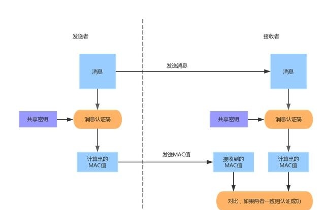
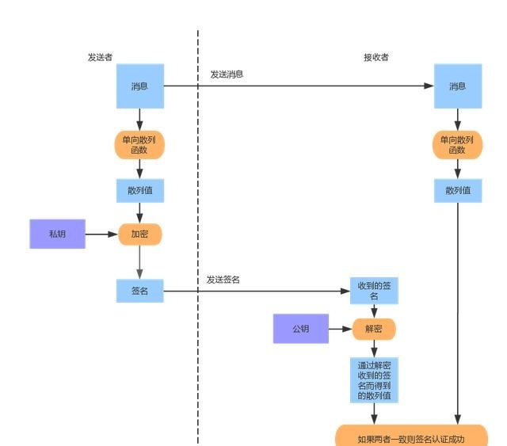

# 『密码学应用』之消息摘要、消息认证码和数字签名

<!-- vim-markdown-toc GFM -->

* [基础概述](#基础概述)
* [消息摘要（Message Digest）](#消息摘要message-digest)
* [消息认证码（Message Authentication Code, MAC）](#消息认证码messageauthenticationcodemac)
* [数字签名（Digital Signature）](#数字签名digitalsignature)
    * [NodeJS 生成并且检验 RSA 签名](#nodejs-生成并且检验-rsa-签名)

<!-- vim-markdown-toc -->

## 基础概述

| 特性                       | 消息摘要 | 消息认证码 | 数字签名 |
|----------------------------|----------|------------|----------|
| 保证消息的完整性           | 是       | 是         | 是       |
| 保证消息的真实性（防篡改） | 否       | 对称加密   | 公钥加密 |
| 保证消息的不可抵赖性       | 否       | 否         | 是       |

## 消息摘要（Message Digest）


将长度不固定的消息（message)作为输入参数，运行特定的**散列函数（hash function）**，生成固定长度的输出，
输出称为散列值（hash code）或消息摘要（message digest）或者指纹（fingerprint），一般用于检查消息的完整性。

常用算法：
*   MD5消息摘要算法（MD5 Message-Digest Algorithm）
*   SHA-2安全散列算法2（Secure Hash Algorithm 2）
*   国密算法SM3

其他概念：
*   **散列碰撞（collision）**：两个输入值不同，但输出的散列值相同
*   **加密散列函数（Cryptographic hash function）** ：对于给定的散列值，没有实用的方法可以计算出一个原始输入
*   **彩虹表（Rainbow table）**：一个用于加密散列函数逆运算的预先计算好的表，常用于破解密码散列，以空间换时间的典型实践。

## 消息认证码（Message Authentication Code, MAC）



可以使用单向散列函数和对称密码技术来实现，保证数据完整性和真实性。

由于 MAC 使用共享密钥至少有两个以上的人知道，所以 MAC 不能保证消息的不可抵赖性，而数字签名可以保证。

常用算法：
*   散列消息认证码（Hash-based message authentication code，缩写为HMAC）

## 数字签名（Digital Signature）



一般的非对称加密流程是发送者使用接受者的公钥加密数据，接受者使用私钥解密数据。

而数字签名签名者将消息的散列值用私钥加密，然后公布公钥，验证者使用签名者的公钥将加密内容解密并比对消息。

*   数字签名算法（Digital Signature Algorithm，DSA）
*   椭圆曲线数字签名算法（Elliptic Curve Digital Signature Algorithm，ECDSA）
    *   椭圆曲线（Elliptic curve，EC）
        *   Ed25519：爱德华曲线（Edwards Curve），专用于数字签名

### NodeJS 生成并且检验 RSA 签名

-   生成签名

    ```js
    /* get_signature.js */
    var fs = require('fs');
    var path = require('path');
    var crypto = require('crypto');

    var rsa_private_key = fs.readFileSync(path.resolve(__dirname, '../config/pem/rsa_private_key.pem'), 'utf8');

    module.exports = function (raw_data) {
      return crypto.createSign('RSA-SHA256').update(raw_data, 'utf8').sign(rsa_private_key, 'base64')
    }
    ```

-   校验签名

    ```js
    /* verify_signature.js */
    var fs = require('fs');
    var path = require('path');
    var crypto = require('crypto');

    var rsa_public_key = fs.readFileSync(path.resolve(__dirname, '../config/pem/rsa_public_key.pem'), 'utf8');

    module.exports = function (raw_data, signature) {
      return crypto.createVerify('RSA-SHA256').update(raw_data, 'utf8').verify(rsa_public_key, signature, 'base64');
    }
    ```

