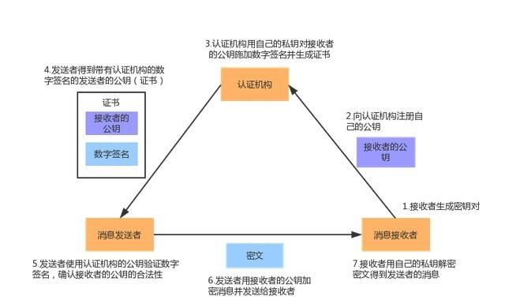

# 『密码学应用』之数字证书

<!-- vim-markdown-toc GFM -->

* [数字证书（Certificate）](#数字证书certificate)
* [数字证书认证机构（Certificate Authority，CA）](#数字证书认证机构certificateauthorityca)
* [根证书（Root Certificate）](#根证书root-certificate)

<!-- vim-markdown-toc -->

## 数字证书（Certificate）

证书包括证书申请者的名称及相关信息、申请者的公钥、签发证书的 CA 的数字签名及证书的有效期等内容。

## 数字证书认证机构（Certificate Authority，CA）

CA 是 PKI 系统中通信双方都信任的实体，被称为可信第三方（Trusted Third Party，简称TTP）

CA 中心为用户发放一个数字证书，可以证明证书中列出的用户合法拥有证书中列出的公开密钥。

*   **X.509**

    广泛使用的数字证书标准，是由国际电联电信委员会（ITU-T）为单点登录（SSO-Single Sign-on）和
    授权管理基础设施（PMI-Privilege Management Infrastructure）制定的 PKI 标准。

*   **证书签署请求（Certificate Signing Request, CSR）**

    证书申请者在申请数字证书时由加密服务提供者（CSP）在生成私钥的同时也生成 CSR 文件，里边包含公钥，
    证书申请者只要把 CSR 文件提交给 CA 后，CA 使用其根证书私钥签名就生成了证书公钥文件，也就是颁发给用户的证书。
    如果一个用户想鉴别一个证书的真伪，他就用 CA 根证书公钥对那个证书上的签字进行验证，一旦验证通过，该证书就被认为是有效的。

*   **证书撤销列表（Certificate Revocation List, CRL）**：

    列出用户不应再信任的所有证书和密钥。CRL 由 CA 生成并定期更新。

*   **注册中心（RA）**

    CA 提供的服务：颁发证书、废除证书、更新证书、验证证书、管理密钥。

    RA 是 CA 功能的一部分，可以由 CA 机构以外的其他机构来完成。

    RA 是具有下列一项或多项功能的实体：标识和鉴别证书申请者，同意或拒绝证书申请，在某些环境下主动吊销或挂起证书，
    处理订户吊销或挂起其证书的请求，同意或拒绝订户更新其证书或密钥的请求。但是，RA 仅代表 CA 承担某些任务，并不签发证书。

    总的来说，CA 是面向各 RA 的，而 RA 是面向最终用户的，RA 是用户与 CA 的中间渠道。

## 根证书（Root Certificate）

CA 也拥有一个证书（根证书），内含 CA 公钥，CA 使用私钥对用户证书进行签名，任何人都可以查看 CA 的证书获取公钥，用以验证它所签发的证书，使得攻击者不能伪造和篡改证书。

根证书没有上层机构再为其本身作数字签名，是 CA 给自己颁发的证书（自签证书），是信任链的起始点。安装根证书意味着对这个 CA 的信任。

许多应用软件（例如操作系统、网页浏览器）会预先安装可被信任的根证书，这代表用户授权了应用软件代为审核哪些根证书机构属于可靠，
可见安装盗版操作系统或破解版浏览器是非常不安全的。

*   查看操作系统和浏览器预置的根证书

    Ubuntu：`/etc/ca-certificates.conf`, `/etc/ssl/certs`, `/usr/share/ca-certificates`

    Google CHrome：<chrome://settings/certificates>

*   **自行安装根证书**：

    虽然应用软件会根据审核标准预载一系列可靠的根证书，但用户仍然可以自行增删其计算机上所安装并信任的根证书清单。

    有时候，用户连接某些网站时，会得到来自应用软件（浏览器）的安全警告，这些网站使用的电子证书一般为自签证书，即未经权威证书机构数字签名担保。
    但基于实际情况，用户仍然可以选择信任网站，跳过警告以继续访问，甚至在浏览器的信任根证书清单增加增加该自签证书，以便日后再设置时不必再收到浏览器的安全警告。

    例如企业内部网的企业级软件，企业的信息工程部门可能在员工的计算机上安装了企业自行管理的根证书，使企业软件不必倚赖外间第三者的证书机构，
    而是可以自行担当企业内部的证书机构；但是这些根证书可能未被广泛认可，只在企业内部适用。

*   **钥匙典礼（Root Key Ceremony）**

    CA 自签一张新的根证书时，需要产生一对公开密钥及私有密钥，这个过程在公证人、律师及录影系统监察下经过一系列严谨的程序，在高度防护的设施内进行。

*   **保护根证书**

    由于根证书在信任链中的重要角色，一旦 CA 的私钥外泄，将可能导致整个信任链被摧毁。

    在信任链设计中，绝大部分的根证书都不会直接为客户签名，而是先签名一个（或多个）中继证书，再由中继证书为客户签名，这可以加强控管能力及控制一旦签名私钥被泄时的损失。

