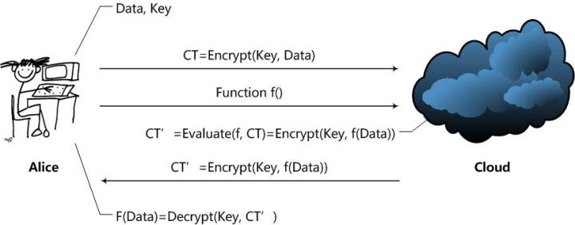

# 『密码学应用』之同态加密

<!-- vim-markdown-toc GFM -->

<!-- vim-markdown-toc -->

同态加密（Homomorphic Encryption）

Craig Gentry 给出的直观定义：

> A way to delegate processing of your data, without giving away access to it.

一般的加密方案关注的都是数据存储安全，已加密的数据只能进行存储或传输。
用户是不能对加密结果做任何操作的，否则会导致错误的解密，甚至解密失败。

同态加密提供了一种对加密数据进行处理的功能。
其他人可以对加密数据进行处理，但是处理过程不会泄露任何原始内容。

同态加密在**云计算**中的应用场景：

TODO...
