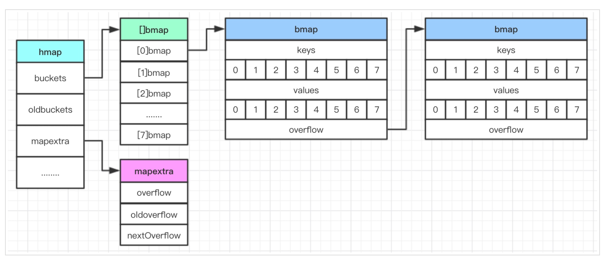
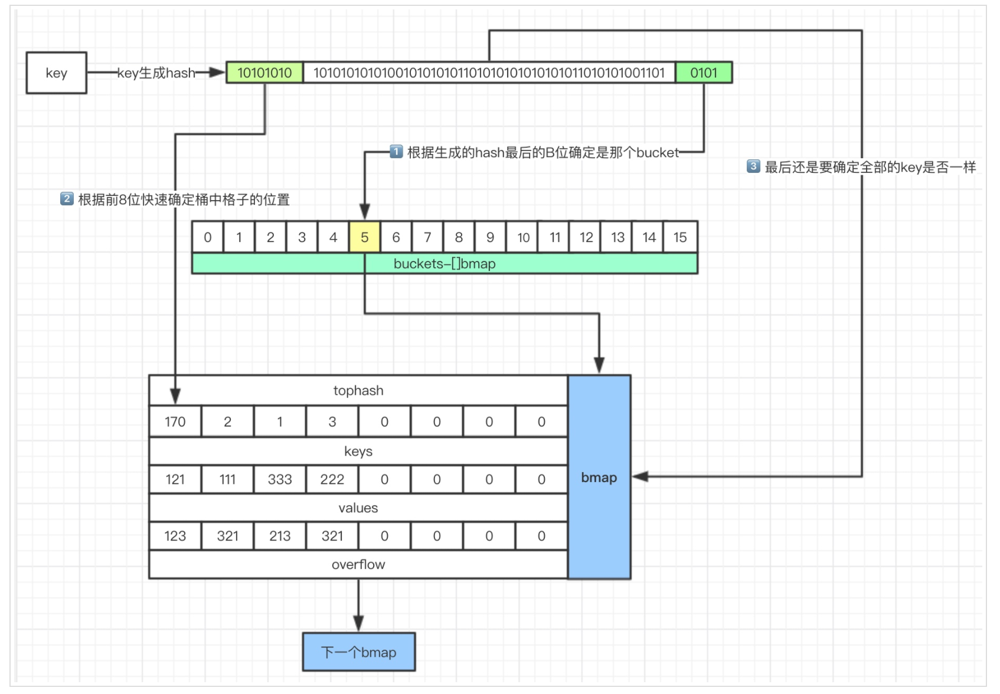

# 『Go 语法基础』之映射（底层实现）

<!-- vim-markdown-toc GFM -->

* [数据结构](#数据结构)
* [查找过程](#查找过程)
* [插入过程](#插入过程)
* [扩容条件](#扩容条件)
* [扩容之后](#扩容之后)
* [参考资料](#参考资料)

<!-- vim-markdown-toc -->

## 数据结构



map 底层由 hashmap 实现，解决 hash 碰撞常用的几种方法：**开放寻址法**、**拉链法**、**再哈希法**。

golang 中采用的是拉链法，即采用链表的数据结构来去存取发生哈希冲突的输入域的关键字。

```go
const (
	// Maximum number of key/elem pairs a bucket can hold.
	bucketCntBits = 3
	bucketCnt     = 1 << bucketCntBits
)

// A header for a Go map.
type hmap struct {
	// Note: the format of the hmap is also encoded in cmd/compile/internal/gc/reflect.go.
	// Make sure this stays in sync with the compiler's definition.
	count     int // # live cells == size of map.  Must be first (used by len() builtin)
	flags     uint8
	B         uint8  // log_2 of # of buckets (can hold up to loadFactor * 2^B items)
	noverflow uint16 // approximate number of overflow buckets; see incrnoverflow for details
	hash0     uint32 // hash seed

	buckets    unsafe.Pointer // array of 2^B Buckets. may be nil if count==0.
	oldbuckets unsafe.Pointer // previous bucket array of half the size, non-nil only when growing
	nevacuate  uintptr        // progress counter for evacuation (buckets less than this have been evacuated)

	extra *mapextra // optional fields
}

// A bucket for a Go map.
type bmap struct {
	// tophash generally contains the top byte of the hash value
	// for each key in this bucket. If tophash[0] < minTopHash,
	// tophash[0] is a bucket evacuation state instead.
	tophash [bucketCnt]uint8
	// Followed by bucketCnt keys and then bucketCnt elems.
	// NOTE: packing all the keys together and then all the elems together makes the
	// code a bit more complicated than alternating key/elem/key/elem/... but it allows
	// us to eliminate padding which would be needed for, e.g., map[int64]int8.
	// Followed by an overflow pointer.
}
```

> bmap 结构体其实不止包含 tophash 字段，由于哈希表中可能存储不同类型的键值对并且 Go 语言也不支持泛型，
> 所以键值对占据的内存空间大小只能在编译时进行推导，这些字段在运行时也都是通过计算内存地址的方式直接访问的，
> 所以它的定义中就没有包含这些字段，但是我们能根据编译期间的
> [cmd/compile/internal/gc.bmap](https://github.com/golang/go/blob/be64a19d99918c843f8555aad580221207ea35bc/src/cmd/compile/internal/gc/reflect.go#L82-L187)
> 函数对它的结构重建：
>
> ```go
> type bmap struct {
>     topbits  [8]uint8
>     keys     [8]keytype
>     values   [8]valuetype
>     pad      uintptr
>     overflow uintptr
> }
> ```

## 查找过程



1.  计算出 key 的 hash 值
2.  低位用于寻找当前 key 属于 hmap 中的哪个 bmap，bmap 是一个链表。
3.  高位用于匹配 bmap 中的 topbits。
4.  如果匹配上了，在 keys 中寻找要查找的 key。
5.  如果匹配不上，直接通过 overflow 匹配下一个 bmap。

## 插入过程

1.  每个 bmap 中存储的 key 的数量由 bucketCnt 常量定义（1<<3，即 8）。
2.  和查找过程一样，根据 key 定位到具体的 bmap。
3.  如果 8 个格子都满了，创建一个新的 bmap 作为溢出桶连接在 overflow 指针。

## 扩容条件

满足两种情况中的其中一个时，容量扩容。

```go
// If we hit the max load factor or we have too many overflow buckets,
// and we're not already in the middle of growing, start growing.
if !h.growing() && (overLoadFactor(h.count+1, h.B) || tooManyOverflowBuckets(h.noverflow, h.B)) {
    hashGrow(t, h)
    goto again // Growing the table invalidates everything, so try again
}
```

**条件一：`if loadFactor := count / (2^B); loadfactor > 6.5 { 扩容 }`**

count 为元素个数，loadFactor 为扩容因子，满足该条件说明：元素太多，桶太少，有很多桶存在 overflow 的情况。

```go
const (
    // Maximum average load of a bucket that triggers growth is 6.5.
    // Represent as loadFactorNum/loadFactDen, to allow integer math.
    loadFactorNum = 13
    loadFactorDen = 2
)

// bucketShift returns 1<<b, optimized for code generation.
func bucketShift(b uint8) uintptr {
    // Masking the shift amount allows overflow checks to be elided.
    return uintptr(1) << (b & (sys.PtrSize*8 - 1))
}

// overLoadFactor reports whether count items placed in 1<<B buckets is over loadFactor.
func overLoadFactor(count int, B uint8) bool {
    return count > bucketCnt && uintptr(count) > loadFactorNum*(bucketShift(B)/loadFactorDen)
}
```

**条件二：`当 B 小于 15，如果 overflow 的 bucket 数量超过 2^B ；当 B >= 15，如果 overflow 的 bucket 数量超过 2^15 。`**

满足该条件说明：某个桶的哈希碰撞太严重，溢出桶太多，即链表被拉的太长了。

```go
// tooManyOverflowBuckets reports whether noverflow buckets is too many for a map with 1<<B buckets.
// Note that most of these overflow buckets must be in sparse use;
// if use was dense, then we'd have already triggered regular map growth.
func tooManyOverflowBuckets(noverflow uint16, B uint8) bool {
    // If the threshold is too low, we do extraneous work.
    // If the threshold is too high, maps that grow and shrink can hold on to lots of unused memory.
    // "too many" means (approximately) as many overflow buckets as regular buckets.
    // See incrnoverflow for more details.
    if B > 15 {
        B = 15
    }
    // The compiler doesn't see here that B < 16; mask B to generate shorter shift code.
    return noverflow >= uint16(1)<<(B&15)
}
```

## 扩容之后

容量：如果满足“条件一”而进行的扩容，扩容后容量为原来的 2 倍，否则（例如满足“条件二”）扩容后容量和原来一样。

增量扩容：旧的数据会保留在 oldbuckets, 在每次 set 或 delete 操作时逐步迁移一部分旧数据。

```go
func hashGrow(t *maptype, h *hmap) {
	// If we've hit the load factor, get bigger.
	// Otherwise, there are too many overflow buckets,
	// so keep the same number of buckets and "grow" laterally.
	bigger := uint8(1)
	if !overLoadFactor(h.count+1, h.B) {
		bigger = 0
		h.flags |= sameSizeGrow
	}
	oldbuckets := h.buckets
	newbuckets, nextOverflow := makeBucketArray(t, h.B+bigger, nil)

	// 中间具体代码省略...

	// the actual copying of the hash table data is done incrementally
	// by growWork() and evacuate().
}

func growWork(t *maptype, h *hmap, bucket uintptr) {
	// make sure we evacuate the oldbucket corresponding
	// to the bucket we're about to use
	evacuate(t, h, bucket&h.oldbucketmask())

	// evacuate one more oldbucket to make progress on growing
	if h.growing() {
		evacuate(t, h, h.nevacuate)
	}
}
```

## 参考资料

*   [go/map.go at master · golang/go](https://github.com/golang/go/blob/master/src/runtime/map.go)
*   [大话图解 golang map 源码详解 | LinkinStar's Blog](https://www.linkinstar.wiki/2019/06/03/golang/source-code/graphic-golang-map/)
*   [map 的实现 · 深入解析 Go](https://tiancaiamao.gitbooks.io/go-internals/content/zh/02.3.html)
*   [理解 Golang 哈希表 Map 的原理 | Go 语言设计与实现](https://draveness.me/golang/docs/part2-foundation/ch03-datastructure/golang-hashmap/)

