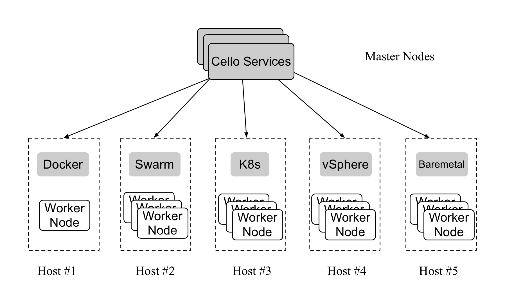

title: Cello
author:
  name: modood
  url: https://github.com/modood
output: index.html

----

# Cello

<br/><center>Warner Ma</center>

----

### What is Cello?

Hyperledger Cello is a toolkit for deploying a <u>**Blockchain-as-a-Service(BaaS)**</u>


----

### Why Cello?

**features**

```
*   Build up a Blockchain as a Service (BaaS) platform quickly from scratch.
*   Manage the lifecycle of blockchain networks,
    e.g., create/start/stop/delete/keep health automatically.
*   Support customized blockchain network config,
    e.g., network size, consensus type.
*   Support multiple underly infrastructure including
    bare-metals, virtual clouds (e.g., virtual machines, vsphere Clouds),
    container clusters (e.g., Docker, Swarm, Kubernetes). More supports on the way.
*   Maintain a pool of running blockchain networks and chains,
    upload smart contract and test... through dashboards.
*   Extends with advanced features like monitoring, logging, health and
    analytics capability by integrating with existing tools like ElasticStack.
```

----

### Cello’s Architecture



----

### Cello’s Architecture

**master-worker architecture**

```
*   Master Node
    Holds Cello services to manage (e.g., create/delete) the chains
    inside Worker Nodes through Worker's management APIs.
    This is the control panel of the whole Cello service,
    and most of the management work should be handled here.
    Usually, Master Node provides web dashboard (port  8080) and RESTful APIs (port 80).

*   Worker Node
    Nodes to hold blockchains. Will be managed by the Master service.
    Cello support several types of worker node from single server to cluster.

    Take Docker host or Swarm cluster for example,
    the Worker's management APIs (i.e., Docker daemon APIs) should be
    accessible (typically on port 2375) from the Master Node.
```

----

### Cello’s Architecture

**master functional layers**

```
*   Access layer
    including those Web UI dashboards operated by users.
*   Orchestration layer
    received the request form Access layer, and make call to correct agents to
    operate the blockchain resources.
*   Agent layer
    real workers that interact with underly infrastructures like Docker, Swarm, K8s.
```

----

### Cello’s Architecture

**master components**


----

### Cello’s Architecture

**master components**

```
*   Orchestration Engine: Core to handle resource management and workload scheduling.
*   Operator Dashboard: Operational interface to handle user, host and network management.
*   User Dashboard: Operational interface to handle chain and smart contract management.
*   Restful Server: Operational interface, which is implemented with Python.
*   Tools: Tools to handle tasks like monitoring, logging and health watcher.
*   Drivers: Currently utilize Docker API lib to support native host and Swarm cluster.
    The driver layer is designed to be pluggable to support more types in future.
```

----

### Workflow

```
1.  setup a cello cluster
2.  dashboard for operator
    (1) add a host
    (2) create a chain(network)
3.  dashboard for user:
    (1) apply a chain
    (2) add a smart contract
    (3) deploy(install & instantiate) a smart contract
    (4) invoke/query a smart contract
```

----

### Database Design

```
1.  operator dashboard mongo:

    user                          用户
    login_history                 用户登录历史
    host                          主机
    cluster                       集群（网络）
    container                     容器
    service_port                  服务和端口

2.  user dashboard mongo:

    caconfigs                     CA 配置
    networkconfigs                网络配置
    orgconfigs                    组织配置
    ordererconfigs                排序服务配置
    peerconfigs                   节点配置
    user                          用户
    chains                        链
    operations                    链上操作记录
    smartcontracts                智能合约信息
    smartcontractcodes            智能合约代码和版本
    smartcontractdeploys          智能合约部署记录
    smartcontractoperatehistories 智能合约操作记录
```

----

### References

*   [github - cello](https://github.com/hyperledger/cello)
*   [hyperledger cello docs](https://cello.readthedocs.io/en/latest/)
*   [hyperledger says hello to cello](https://www.hyperledger.org/blog/2017/01/17/hyperledger-says-hello-to-cello)

----

# Thanks

<br/><center>2018.10.25</center>

