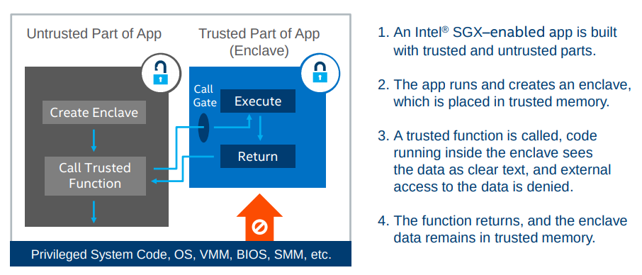

title: Intel® SGX
author:
  name: modood
  url: https://github.com/modood
output: index.html

----

# Intel® SGX

<br/><center>Warner Ma</center>

----

### Intel® Software Guard Extensions

**about**

```
A Trusted Execution Environment from Intel for applications.

Delivers enhanced privacy and security that can help protect
blockchain transactions, and help improve throughput and consensus efficiency.

Isolates a portion of physical memory to protect select code and data from view or
modification. In Intel SGX, these isolated portions of memory are called “enclaves”.
```

----

### Intel® Software Guard Extensions

**features**

```
*   Confidentiality and integrity
    Enforced at the operating system, BIOS, VMM, SMM, or TEE layers even in the
    presence of privileged malware.

*   Low learning curve
    A familiar operating system programming model integrates with the parent
    application and executes on the main processor.

*   Remote attest and provision
    A remote party can verify an application enclave identity and securely provision
    keys, credentials, and other sensitive data to the enclave.

*   Small attack surface
    The processor boundary becomes the attack surface perimeter—all data, memory,
    and I/O outside this perimeter is encrypted.
```

----

### Intel® Software Guard Extensions

**faq**

```
How will it be possible to tell if a system is Intel SGX capable?

Intel® vPro™ technology, Intel® Core™ processor, Intel® Pentium® processor and
Intel® Celeron® processor branded systems with initial ship dates in Q3 2015 will
have Intel SGX silicon capabilities.

In order to use Intel SGX, BIOS support is required. OEMs can choose whether to
provide BIOS support or not. If BIOS support is provided, it can be shipped
turned on or turned off.
```

----

### Intel® Software Guard Extensions

**faq**

```
What Do You Need to Develop and Run Enclaves?

*   A platform with an Intel® SGX-enabled CPU and BIOS
*   Intel SGX platform software (PSW)
*   The Intel SGX software development kit (SDK)
```

----

### Trusted and Untrusted Partitions

**workflow**



----

### Intel® SGX and Blockchain

**Hyperledger Sawtooth**

```
https://www.hyperledger.org/projects/sawtooth

Hyperledger Sawtooth is an enterprise solution for building, deploying, and
running distributed ledgers.
```

**Proof of Elapsed Time (PoET)**

```
A Nakamoto-style consensus algorithm that is designed to be a production-grade
protocol capable of supporting large network populations.

PoET relies on secure instruction execution to achieve the scaling benefits of
a Nakamoto-style consensus algorithm without the power consumption drawbacks of
the Proof of Work algorithm.

Uses Intel SGX for an economical leader election process.
```

----

### Intel® SGX and Blockchain

**Microsoft Coco Framework**

```
https://github.com/Azure/coco-framework

Microsoft uses Intel Software Guard Extensions (Intel SGX) to protect the Coco Framework.

The trusted execution environment of Intel SGX enables Coco to deliver a novel consensus
mechanism that can deliver up to 1600 transactions per second and also helps Coco
transactions remain confidential among blockchain participants.

Status:

Microsoft plans to open source the Coco Blockchain Framework code in 2018
```

----

### Intel® SGX and Blockchain

**Hyperledger Labs MinBFT**

```
https://github.com/hyperledger-labs/minbft

MinBFT is a pluggable software component that allows to achieve Byzantine fault-tolerant
consensus with fewer consenting nodes and less communication rounds comparing to the
conventional BFT protocols.

*   it requires only 2f+1 consenting nodes in order to tolerate f faulty nodes
    (or tolerate up to half of faulty nodes);
*   committing a message requires only 2 rounds of communication among the nodes
    instead of 3 rounds as in PBFT

Status:

This project is in experimental development stage.
It is not suitable for any kind of production use.
```

----

### Hardware on trend

**trends**

```
However, Intel is not the only player seeking to position its hardware as essential
for blockchain development.

Earlier this year (2017), tech consultancy Accenture integrated the Thale's
hardware security module (HSM) in an effort to end the debate in enterprise circles
over blockchain's security loopholes.
And IBM offers users of its High Security Business Network access to its HSM too.

The Initiative For CryptoCurrencies & Contracts (IC3) proposed using SGX to
help scale bitcoin, it sparked a heated debate.

Not everyone agrees hardware solutions will solve blockchain's security problems,
though. Microsoft itself touted its software-based trusted execution environments (TEEs)
at the same launch where Echevarria was discussing Intel's hardware-based strategy.
```

----

### Hardware on trend

**disputes**

```
Silicon Blockchain: Intel's Distributed Ledger Strategy Is All About Hardware
http://t.cn/EwLCOWB

Hardware Over Hard Forks: How Accenture Plans to End Blockchain's Security Debate
http://t.cn/EwLCHEp

Blockchain hardware in your data center might not solve any problems
http://t.cn/EwLC3fs

Intel is Winning Over Blockchain Critics By Reimagining Bitcoin's DNA
http://t.cn/EwLCknr

Trusted Hardware Can Help Bitcoin Scale, But At What Cost?
http://t.cn/EwLNZdn
```

----

### References

**references**

```
Intel and Blockchain—Better Together：How Intel is Shaping Blockchain Technology
http://t.cn/EwL1K3t

Create a Silicon-based Trusted Infrastructure
http://t.cn/EwL1lZM

Hardware-Enabled Security Powered by Intel® Technology
http://t.cn/EwL1n7o

Intel SGX Homepage | Intel® Software
http://t.cn/RCme793

Silicon Blockchain: Intel's Distributed Ledger Strategy Is All About Hardware
http://t.cn/EwLCOWB

Blockchain Moves Beyond Bitcoin - iQ by Intel
http://t.cn/EwLB4A0
```

----

# Thanks

<br/><center>2018.10.31</center>

